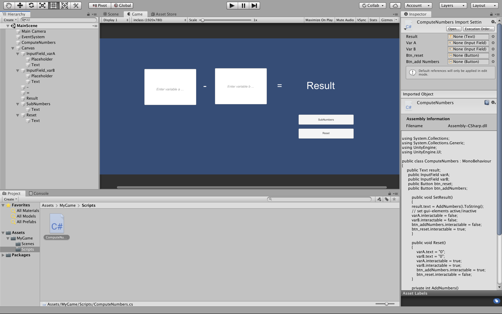

# Unity2019114f1-2D-Template

### Project description: 
create GitHub repository, clone it, build a Gui in Unity, subtract numbers, displays result  

### Development platform: 
Mac OS Mojave, Unity 2019.1.14f1, Visual Studio Code 1.41.0

### Target platform: 
WebGL (refRes: 1920x780) 

### Visuals: 

### Necessary setup/execution steps: 
-

### Third party material: 
Template: https://github.com/3ahmnm-htlsbg/Unity2019114f1-2D-Template 

### Project state: 
TODO

### Limitations: 
None

### Lessons Learned:
+ create Gui in Unity with inputfields, buttons, text
+ create ref resolution in Unity

Copyright by millig 